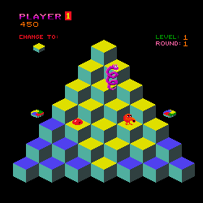

# Q*bert

Classic 1982 Arcade game implementation, equipped with Q*bert-related sprites, utilizing the STL library, developed within the course “Software Engineering of Intelligent Mobile and Multimedia Interfaces”.

